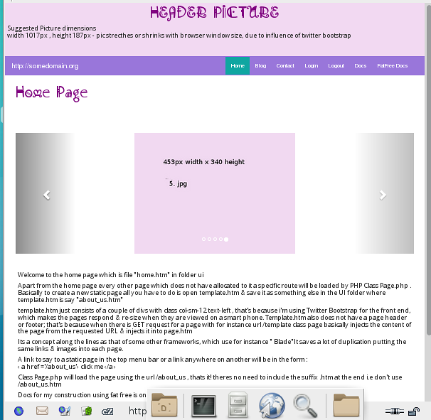

There are two purposes for this project. One came from talking to SME business  where really 
they just want something light - a basic website  of static pages,a contact form where people
can get back to them  & functionality of being able to submit  blogs 
(including a picture) they can do themselves by just pasting text 
into a GUI on the live web site.

Also if they need help from someone , they want it to be fairly easy for 
someone with a little PHP knowledge to be able to do this.One thing 
about fatfree is its very easy to use your own PHP classes, native PHP & edit code.


Also from my experience there are two ways to learn code; for 
instance with f3 download the zip ,read documentation & get on with it.

 Another way is to download a roughly working web , or to put it another way 
somebody's use of the developers download  & to take a watch makers analogy -take it apart 
& see how it ticks.


The main points /features are:

1) On login as admin :

user:admin

pass:Englishman 

you should see a couple of links quoted where you can 
change the default password & link to submit a blog.  


2) It uses Twitter bootstrap so its fairly smart phone (therefore Google friendly) ;
just minimize Browser Window & you should see menu change to toggle type.Everything
 including header image should shrink

3) Class page in api/controllers  handles all static pages where there is no specific
 route set up for a  page. All pages including home.htm are in ui folder. 
 To create more pages just open template.htm with a text editor & edit text,add text
  & save it to the page you want eg about_us.htm  then create a link to about_us.htm
   such as 

```
  
<a href ="/about_us">about us</a>
```

You don't need to include the sufix of .htm in the link.You could have hundreds of static pages & they will all be handled by page class. 
Which injects the content into page.htm

For the blog i had to alter page.htm & add a couple of other pages to make it work including  
blogTitles.htm,  blogArticle.htm . So you are going to have to edit menu & footer section so  
it all matches. 


4) Specific routes are listed in routes.ini 
4a) Config for values including for SMTP setup for contact_us to work are in config.ini

5) 
 There is a basic form GUI in order to submit a blog ,which is just a case of copy & paste 
text into form text boxes of title, key words , article. key words are used to populate meta tags
There is a browse button to search for & upload one image for the blog which should be circa
 350 px wide x 350 px height.  In my case i will be submitting all blogs, so i have 
 not bothered with checking if file  is a genuine image etc, or filtering characters 
 which might make sqlite3 choke. You can use 

```
 <p> </p>  for outside of paragraph's & also <br>
 
 
 ```
 6) To get this to run almost out of the box so on databases that might cause 
an issue with MySQL such as grant permissions etc. IN the end i just went for sqlite3 
which means aprt form other things I can develop from a folder on my desktop using PHP's built
in server than mess about with XAMPP, Apache which can be a pain to edit codeon lInux.

The GUI to submit a blog is at  /blogSubmitForm but you need to be logged in as admin, 
to have access to the page.
  
 7) The blog will allow for user comments - there is a status field  of either 0 or 1 so 
 that it can be used  to either show or hide comments but i have not implemented it yet, 
 so the default is all comments will show. I have NOT yet   added pagination
 One quirk thing is text for image path in blogImages saves to db in 
 lower case, so if you call an image SomeImage.png it will be there , 
 but Will not be seen on blogArticle page
 
 
 8) The web users a basic MVC - i can't get my head around ORM 
 so i mostly use PDO. Some code needs shifting from controller to model

9) I aim to add forum code at a later date  so there is a route /userRegistration which can be developed later

10) The home of fatfree is  [fatfree ]( https://fatfreeframework.com/3.6/home ) in case you are in a difficult
access to Internet i left the fatfree docs which are at /userRef

